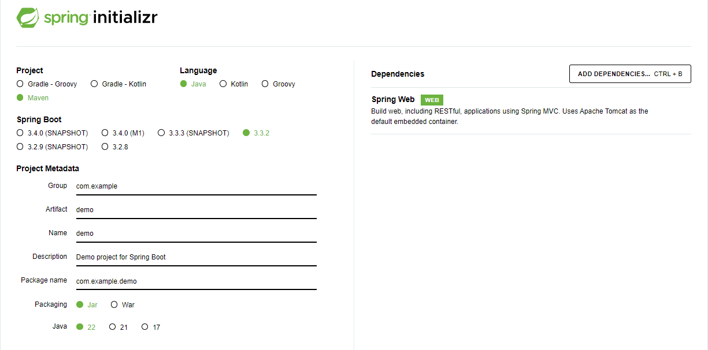

# spring-docker-starter

สร้าง project ด้วย https://start.spring.io/

คำสั่ง build แล้ว pack ไพล์เป็น .jar

    $ ./mvnw package

คำสั่ง run ไพล์ที่เรา build เสร็จ

    $ java -jar target/demo-0.0.1-SNAPSHOT.jar

คำสั่ง build เป็น docker images

    $ docker build . -t ilmsg/spring-docker-starter

คำสั่ง run จาก images, เลือก port ที่ต้องการใช้ได้เลย

    $ docker run -p 8080:8080 ilmsg/spring-docker-starter
